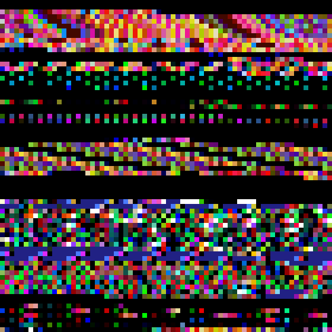

# bmpify

*Turn any file into a 16-bit bitmap image.*

## Compiling

### Linux

`make`, or `make && sudo make install && make clean`.

### Windows

The source files can be compiled on Windows. A version compiled with Visual Studio 2015 can be downloaded from [releases](releases).

## Usage

`bmpify input-file output-file`

Here's what `bmpify.exe` looks like as a bitmap image:

`./bmpify bmpify.exe example.bmp`

